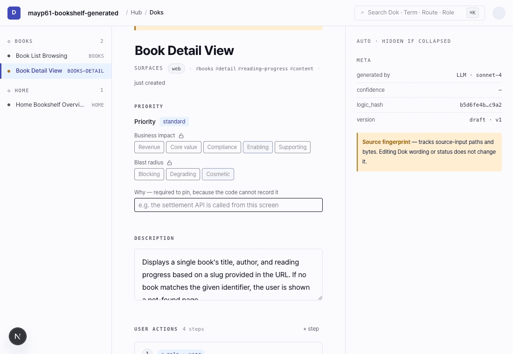
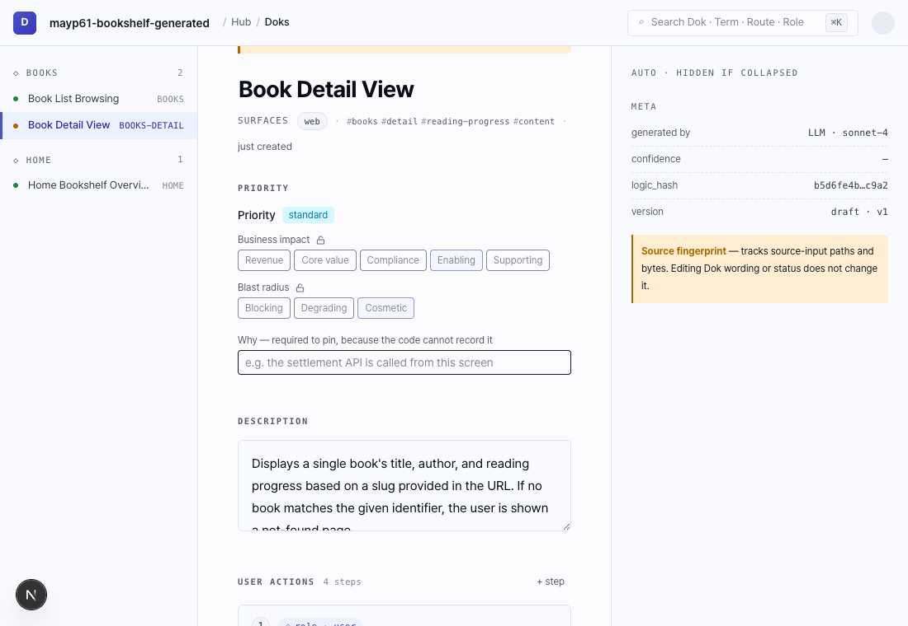

<p align="center">
  
</p>

<p align="center"><strong>기술의 결과를, 사람의 이해로.</strong><br>
Doklo는 AI가 만든 소프트웨어를 읽어 사람이 읽고 검토하고 전달할 수 있는 제품 설명으로 바꿉니다.</p>

<p align="center">
  <a href="https://www.npmjs.com/package/@mayp/doklo"></a>
  <a href="./LICENSE"></a>
  <a href="https://github.com/mayp-ai/doklo/actions/workflows/ci.yml"></a>
</p>

<p align="center"><a href="README.md">English</a> | <a href="README.ko.md">한국어</a></p>

<p align="center">
  
</p>
<p align="center"><i>Studio: 같은 Hub에서 기능 설명, 화면 구조(IA), 역할을 차례로 확인합니다.</i></p>

<details>
<summary>기능 설명 정적 화면 보기</summary>

<p align="center">
  
</p>
</details>

## 주요 기능

- **코드에서 설명 초안을 만듭니다.** 코드를 읽어 기능마다 무엇을 하는지, 사용자가 밟는 단계, 규칙, 확인 기준을 씁니다. 모든 설명은 근거가 된 소스 파일로 이어집니다.
- **승인은 모델이 아니라 사람이 합니다.** 생성된 설명은 Studio에서 사람이 검토해 `active`로 바꾸기 전까지 `draft`입니다. stable 도움말은 active 설명으로만 만들어집니다.
- **도움말과 팀 문서로 내보냅니다.** 승인된 설명은 고객 도움말, 도움말 색인, 온보딩 문서, 변경 이력 등으로 만들어져 여러분의 앱이나 저장소에 놓입니다.
- **코딩 AI도 같은 설명을 읽습니다.** Claude Code, Cursor, Claude Desktop이 MCP로 설명을 검토 상태·최신 여부와 함께 조회합니다. 코드가 바뀌면 `doklo sync --check`가 다시 볼 설명을 알려 주고 `doklo sync`가 다시 생성합니다.

## 설치

```bash
npm install -g @mayp/doklo@preview
```

Node.js 20.9 이상이 필요합니다. 작업 공간마다 프로젝트 하나를 지원합니다. 실행 전에 [현재 지원하는 프레임워크](#시작하기-전에-알아-둘-것)를 확인하십시오.

아래 범용 분석 기능은 다음 출시를 위한 저장소 소스에 반영돼 있습니다. 현재 공개된 `0.1.0` preview는 Next.js App Router를 지원합니다. 다음 npm 배포 전에 범용 분석을 사용하려면 이 소스로 빌드한 패키지를 설치해야 합니다.

## 빠른 시작

```bash
doklo init                 # 프로젝트 확인, 모델·브랜치 선택, 스킬 설치,
                           # 코드 스캔 후 다음 CLI 명령 안내
doklo generate             # 기능마다 설명 초안 하나씩 생성
doklo serve --open         # Doklo web에서 초안을 검토하고 승인
doklo sync --check         # 코드가 바뀐 뒤: 다시 볼 설명 확인
```

생성 전 CLI는 이번 실행 대상의 업무 영역과 대표 기능을 요약합니다. `--plan-details`로 전체 Dok ID를 볼 수 있습니다. 큰 계획은 보수적인 보호 한도에 따라 분할될 수 있으며, 이번 실행과 보류 개수를 구분해 표시합니다. 보류 문서는 자동 실행되지 않습니다. 예상 입력·출력 토큰과 최대 출력 허용량은 별도로 표시하며, 완료 시 실패 응답까지 포함한 실제 토큰을 동일한 호출 범위의 예상과 비교합니다. 제공사가 사용량을 반환하지 않은 호출은 미측정으로 표시합니다. `--force`가 없으면 기존 Dok은 다시 생성하지 않습니다.

초기화는 CLI에서 끝납니다. 초안을 생성한 뒤 `serve`로 Doklo web을 열어 검토합니다.

생성에는 선택한 모델과 인증 설정을 사용합니다. 선택한 소스 코드 일부는 해당 모델 제공자에게 전송됩니다. 경로별 내용은 [모델 가이드](./docs/ko/models.md)에서 확인합니다.

코딩 AI 연결 방법은 아래 [AI 에이전트에서 사용하기 (MCP)](#ai-에이전트에서-사용하기-mcp) 절에 있습니다.

## 시작하기 전에 알아 둘 것

- **프레임워크 지원:** 전용 파서나 package.json 없이도 범용 소스 분석을 사용할 수 있습니다. Next.js App Router는 전용 파서로 라우트와 의존성 정보를 보강하며, 다른 프레임워크의 파서도 차차 추가할 수 있습니다. 여러 언어가 섞인 프로젝트의 다른 소스 파일도 분석 대상에 포함됩니다.
- 범용 분석은 읽을 수 있는 UTF-8 파일이 24개 이하면 함께, 그보다 많으면 디렉터리별 후보로 묶어 모델 검토에 전달하고 발견한 소스 파일 전체를 보수적으로 추적합니다. 알려진 비밀 설정 경로·바이너리·의존성/빌드 산출물·Git 제외 파일·1 MiB 초과 파일은 제외합니다. 일반 소스 파일 안에 적힌 비밀값까지 판별하지는 않으므로 해당 경로는 분석 전에 `.gitignore`로 제외해야 합니다. 파일을 추가한 뒤에는 다시 스캔해야 합니다.
- 기능 하나의 소스 본문이 192,000자를 넘으면 생성 전에 중단하며, 내용을 잘라서 보내지 않습니다. 큰 기능은 서비스나 생성 묶음을 나눠야 합니다.
- `doklo sync`는 지원되는 모델과 인증 프로필을 선택해 다시 생성합니다. 자격 증명 없는 로컬 Claude Code 경로는 `generate`에서만 됩니다.
- 전용 파서의 추적은 깊이가 제한된 정적 import 선언을 대상으로 합니다. 동적 import와 런타임 연결은 빠질 수 있습니다. 내부 import를 해석하지 못하면 스캔을 중단하며, 이전 추적 정보는 복구·검토 전까지 unknown으로 표시합니다.
- 설명은 틀리거나 빠지기도 합니다. "최신"은 추적하는 소스 파일이 바뀌지 않았다는 뜻이지, 내용이 맞다는 뜻이 아닙니다.
- stable 도움말에서는 내부 식별자가 남은 설명을 제외하고 알려 줍니다. `workspace.json`의 `stable_public_terms`에 적은 단어는 식별자로 보지 않습니다(정확히 일치할 때만).

## Live Doc 만들기

빌트인 카탈로그는 16종입니다. **stable 7종**(`feature-matrix`, `github-onboarding`, `help-index`, `help-page`, `keep-a-changelog`, `permission-gap`, `release-digest`)과 **experimental 9종**이며 기본 목록에는 stable 템플릿이 나옵니다. 나머지는 `--experimental`로 명시적으로 확인합니다.

```bash
# stable 계약을 확인하고 active 상태의 사람 검토 Dok 하나를 렌더합니다.
doklo template list
doklo live-docs render help-page --dok AUTH-SIGNUP --locale ko

# 선택을 저장해 프로세스 재시작 후에도 조회하고 다시 렌더합니다.
doklo live-docs publication create signup-help \
  --template help-page --dok-id AUTH-SIGNUP \
  --format markdown --locale ko
doklo live-docs publication render signup-help --dry-run
doklo live-docs publication render signup-help
```

experimental 템플릿은 직접 렌더와 저장 Publication 명령 모두에서 경고합니다. PPTX·XLSX·HWPX는 공식 소비 앱 검증이 release gate에 연결되지 않아 experimental입니다. 스크린샷 capture는 experimental이며 현재 사용할 수 없습니다. output publication이 문서화된 Doklo-exclusive [single-writer 계약](docs/livedocs-publications-plan.md#41-dry-run과-렌더-증거)을 충족하고 실제 앱 → capture → stable 문서 E2E가 gate에 포함되기 전까지 비활성 상태입니다. Live Docs는 스냅샷이므로 이후 Hub 변경을 반영하려면 다시 렌더해야 합니다.

모든 생성 Dok은 `status: "draft"`로 저장됩니다. 사람이 Studio에서 명시적으로 검토하고 `active`로 전환해야 stable renderer가 받습니다. 명시적 선택이 없으면 stable renderer는 active Dok만 포함하고 draft·planned·deprecated·archived Dok을 명시적으로 선택하면 `UNREVIEWED_DOK`으로 fail-closed합니다. stable workspace 템플릿은 안전하지 않은 active Dok 하나를 `SKIPPED_STABLE_DOK` 경고와 함께 제외하고 나머지를 렌더하며 안전한 Dok이 하나도 없으면 실패합니다.

## 생성한 문서 배포하기

렌더 결과는 기본적으로 `.doklo/output/` 아래에 남습니다. 저장한 Publication에는 작업 공간 기준 상대 경로 `--destination`을 줄 수 있고 `publish`가 마지막 렌더 결과를 그 폴더로 복사합니다. `publish`는 파일을 여러분의 디스크에 놓을 뿐입니다. 앱 개발 서버로 열어 확인하고 온라인에 올리려면 앱을 평소대로 배포하십시오. 0.1.0에서는 여러분의 앱과 저장소가 호스팅을 맡습니다. 이 CLI의 `publish`에는 Doklo Cloud 업로드나 호스팅이 포함되지 않습니다.

```bash
# 고객 도움말: 검토한(active) Dok을 선택해 public/help/ 아래 HTML 기사로 만듭니다.
# 이 Next.js 예제에서는 public/help/<DOK-ID>.html을 /help/<DOK-ID>.html로 서빙하므로
# `next dev` 뒤 http://localhost:3000/help/<DOK-ID>.html 에서 기사가 열립니다.
doklo live-docs publication create customer-help \
  --template help-page --status active --format html --locale ko \
  --destination public/help
doklo live-docs publication render customer-help
doklo live-docs publication publish customer-help --dry-run
doklo live-docs publication publish customer-help

# 팀 문서: GitHub가 렌더하는 Markdown입니다. Publication마다 docs/ 아래
# 전용 폴더를 주세요. 폴더 하나는 Publication 하나만 소유합니다.
doklo live-docs publication create team-onboarding \
  --template github-onboarding --status active --format markdown --locale ko \
  --destination docs/doklo/onboarding
doklo live-docs publication render team-onboarding
doklo live-docs publication publish team-onboarding

doklo live-docs publication create team-permissions \
  --template permission-gap --status active --format markdown --locale ko \
  --destination docs/doklo/permissions
doklo live-docs publication render team-permissions
doklo live-docs publication publish team-permissions
```

`render`를 실행할 때마다 생성된 파일과 제외 경고를 확인하십시오. `SKIPPED_STABLE_DOK` 진단은 내부 식별자 때문에 제외된 Dok을 알려 줍니다.

`publish`는 네 가지 규칙을 지킵니다.

- 자기가 쓰지 않은 파일은 바꾸지 않습니다. 같은 이름의 직접 수정한 파일이나 관계없는 파일이 있으면 `PUBLICATION_PUBLISH_BLOCKED`로 멈추고 목적지는 그대로 둡니다.
- 바뀌지 않은 결과는 다시 쓰지 않고 `unchanged`로 보고합니다.
- 목적지 폴더 하나는 Publication 하나가 소유합니다. 같은 폴더를 목적지로 지정한 두 번째 Publication은 `PUBLICATION_PUBLISH_BLOCKED`로 막히므로 Publication마다 폴더를 따로 지정하십시오. 도움말 색인과 기사를 함께 내려면 기사를 색인 한 단계 아래 폴더에 발행하고 색인이 `link_prefix`로 그곳을 가리키게 합니다.

  ```bash
  # 1. 기사: 렌더한 뒤 결과의 rendered_dok_ids를 읽습니다
  #    (stable 검사가 제외한 Dok은 선택됐지만 렌더되지 않습니다).
  doklo live-docs publication create help-articles \
    --template help-page --status active --format html --locale ko \
    --destination public/help/pages
  doklo live-docs publication render help-articles --json   # "rendered_dok_ids" 확인
  doklo live-docs publication publish help-articles

  # 2. 색인: 렌더된 Dok만 --dok-id로 골라 한 단계 위 폴더에 냅니다.
  #    rendered_dok_ids가 ["HOME"]이면 HOME만 고릅니다. 렌더된 기사가 더 있으면
  #    --dok-id를 하나씩 추가하세요.
  doklo live-docs publication create help-index \
    --template help-index --dok-id HOME --format html --locale ko \
    --var link_prefix=./pages/ --destination public/help
  doklo live-docs publication render help-index
  doklo live-docs publication publish help-index
  # /help/help-index.html 색인은 /help/pages/<DOK-ID>.html 에 실제로 있는 기사만 링크합니다
  ```

  색인을 상태로 고르면 기사 렌더가 제외한(`SKIPPED_STABLE_DOK`) Dok까지 나열돼 그 항목이 빈 링크가 됩니다. 렌더된 기사 목록이 바뀌면 색인 정의와 렌더를 갱신하십시오. `publication create help-index --overwrite ...`는 저장된 정의를 바꾸고 `publication render help-index --overwrite`는 이 Publication이 `.doklo/output/` 아래에 만든 자기 파일만 다시 쓰며 `publish`는 목적지에 평소 규칙을 그대로 적용합니다(자기가 쓰지 않은 파일은 여전히 건드리지 않습니다).
- 결과 옆에 `doklo-publish.json` 원장(Publication 이름, 정의 해시, 발행한 파일 경로와 해시, 발행 시각)을 써서 다음 발행 때 자기 파일과 여러분의 파일을 구분합니다. `public/` 아래에 두면 이 원장도 사이트와 함께 서빙되므로 Publication 이름을 정할 때 염두에 두십시오.

## AI 에이전트에서 사용하기 (MCP)

Hub를 AI 에이전트(Claude Code, Claude Desktop, Cursor 등)에 read-only stdio MCP 서버로 노출합니다. 서버는 로컬에서 동작하며 모델 프로바이더나 Doklo 클라우드를 호출하지 않고 연결한 MCP 클라이언트에 요청된 Hub 데이터를 반환합니다. 생성은 별도의 명시적 작업입니다. 사용자가 승인한 뒤에만 선택한 소스 코드 일부가 direct Anthropic 또는 로컬 Claude Code session으로 전송됩니다.

같은 JSON을 Claude Code / Claude Desktop / Cursor(`.cursor/mcp.json`)에 동일하게 등록합니다.

```json
{ "mcpServers": { "doklo": { "command": "doklo", "args": ["mcp"] } } }
```

MCP 클라이언트는 보통 작업 디렉토리를 보장하지 않으므로 프로젝트 루트를 명시적으로 넘기는 것을 권장합니다.

```json
{ "mcpServers": { "doklo": { "command": "doklo", "args": ["mcp", "--root", "/path/to/your/project"] } } }
```

| 툴 | 입력 | 반환 |
| --- | --- | --- |
| `search_doks` | `query` | `query`, `total`, `results[]`: `dok_id`, `name`, optional `description`, `status`, `is_stale`, `matched_on` |
| `get_dok` | `dok_id` | `dok_id`, `name`, `description`, `status`, `tags`, `surfaces`, `user_actions`, `business_rules`, `acceptance_criteria`, `source_anchors`, `is_stale` |
| `list_doks` | `status?` / `service?` / `stale?` | `total`, `doks[]`: `dok_id`, `name`, `status`, `tags`, `is_stale`. `unknown` Dok은 boolean stale filter 어느 쪽에도 포함되지 않음 |

이 툴들은 모든 lifecycle 상태의 Dok을 반환할 수 있습니다. `status`를 확인하십시오. `draft`는 AI가 생성하고 사람 검토를 기다리는 상태이며 `active`만 명시적 검토 전이를 거쳤음을 뜻합니다. freshness는 별개 신호이며 의미 정확성을 인증하지 않습니다.

`is_stale`은 세 성공 응답 모두에서 tri-state입니다. `true`는 추적 소스 파일이 없거나 재계산한 hash가 다름, `false`는 저장된 hash와 현재 hash가 일치함, `"unknown"`은 저장된 hash가 없거나 이전 추출기로 만든 추적 정보를 아직 검증하지 못했음을 뜻합니다. 추적 범위를 복구했지만 문서 검토가 필요한 경우에는 stale로 표시합니다. workspace를 resolve·read·parse할 수 없으면 성공 `unknown` payload가 아니라 MCP tool error를 반환합니다. 이는 소스 변경만 감지하며, `false`가 Dok의 사실 정확성이나 완전성을 검증하지는 않습니다.

### 코딩 에이전트 안내

기능을 수정하기 전에 읽기 전용 MCP의 `search_doks`와 `get_dok`으로 관련 문서를 읽으십시오. MCP 설정에는 프로젝트 루트를 명시하십시오. MCP가 없으면 프로젝트 디렉터리에서 `doklo show`로 목록을 보고 `doklo show <ID> --json`으로 문서를 확인하십시오.

검토 상태와 최신 여부를 함께 확인하십시오. `draft`는 사람 검토 전입니다. `active`도 소스 변경으로 낡았거나 내용이 불완전할 수 있습니다. `is_stale: false`는 추적 소스 해시가 같다는 뜻이며 내용 정확성을 보증하지 않습니다. `unknown`은 최신으로 간주하지 마십시오. 정확성이 필요한 주장은 코드와 대조하고 충돌을 보고하십시오.

개발 중에는 기존 Dok을 참고하십시오. 설정한 기록 기준 브랜치에 반영한 뒤, 기록 작업이 승인된 경우 그 브랜치의 깨끗한 체크아웃에서 `doklo sync --check --json`을 실행하십시오. 종료 코드와 JSONL 마지막 result·diagnostics를 함께 읽으십시오. 개발 중 매 커밋마다 기록을 요구하거나 문서를 임의로 재생성하거나 사람 편집을 강제로 덮어쓰거나 active로 바꾸지 마십시오.

사용자가 새 문서 생성을 요청하면 `doklo init --yes --json`으로 초기화한 뒤 승인된 모델 경로로 초안을 생성하십시오. 생성 과정에서 선택한 소스 코드 일부가 모델 공급자에게 전송될 수 있습니다. 생성·재생성이 끝나면 사용자가 `doklo serve --open`으로 Studio에서 초안을 검토하도록 안내하십시오. 실행 동의는 결과 문서의 검토 승인이 아닙니다.

현재 키 없는 Claude Code 경로는 `generate`에 제공됩니다. `sync`에도 같은 경로가 있다고 가정하지 마십시오. 필요한 경로를 쓸 수 없으면 공급자를 조용히 바꾸지 말고 제한을 알려 주십시오.

generate/sync를 실행하기 전에 전송 소스·모델 경로·예상 토큰·보호 한도를 사람에게 보여 주고 해당 실행의 동의를 받으십시오. 비대화형 -y는 그 동의를 전달하는 용도로만 쓰십시오.

같은 안내는 배포 패키지의 [`AGENT_GUIDE.md`](./AGENT_GUIDE.md)에도 포함됩니다.

## 동작 방식

Doklo는 제품이 무엇을 하는지 담은 작은 JSON 파일 묶음 — **Hub** — 를 저장소 안에 만듭니다.

1. **scan** — 코드에서 결정적(deterministic) 중간표현(IR)을 추출합니다(route, component, state, role).
2. **consolidate** — 흩어진 코드를 하나의 비즈니스 기능 단위로 묶습니다.
3. **generate** — LLM이 기능마다 source-grounded **Dok** 하나를 `status: "draft"`로 작성(intent, user actions, business rules, acceptance criteria)하고 원본 파일로 되짚는 provenance anchor를 붙입니다. 사람이 초안을 명시적으로 `active`로 전환한 뒤에만 검토된 product context로 취급합니다.

Hub는 `.doklo/hub/`에 기록되며 추적할 workspace state에는 루트 `workspace.json`, `.doklo/.gitignore`, `.doklo/livedocs/` Publication definition도 포함됩니다. 파생 cache, debug trace, render, screenshot은 기본적으로 ignore됩니다. **Studio**에서 초안을 검토하고 **MCP**로 Hub 데이터를 query하고 stable Live Doc 7종을 렌더할 수 있습니다. 추가 9개 템플릿은 명시적으로 experimental입니다.

## 문서

- 한국어: [docs/ko/](./docs/ko/)
- English: [docs/en/](./docs/en/) · [README.md](./README.md)
- [Changelog](./CHANGELOG.md) · [License](./LICENSE) (Apache-2.0)

## 참고

설치할 때는 네트워크가 필요합니다. 배포 패키지가 런타임 의존성을 함께 담지 않고 목록만 선언하기 때문에(직접 의존성 23개, 설치 시 349개 패키지), npm이 레지스트리에서 의존성을 내려받습니다. 설치를 마친 뒤에는 `init`, `scan`, `serve`, `mcp`, `live-docs render`, `sync --check`가 네트워크 없이 동작합니다. 모델 프로바이더를 호출하는 명령은 `generate`와 다시 생성하는 `sync` 둘뿐입니다.

`npx @mayp/doklo`는 실행할 때마다 캐시를 다시 확인하기 때문에 매번 5~8초가 걸립니다. 계속 사용할 계획이라면 전역 설치를 권장합니다.

렌더된 HTML 도움말 페이지는 Pretendard 웹폰트를 CDN에서 `@import`로 불러옵니다. 인터넷이 없는 환경에서도 페이지는 그대로 렌더되고 글꼴만 시스템 기본 글꼴로 대체됩니다.

## 라이선스

라이선스: **Apache-2.0**. Licensed under the Apache License, Version 2.0. [LICENSE](./LICENSE)와 [NOTICE](./NOTICE)를 참고해 주세요. 별도 Doklo Cloud 서비스와 외부 구성 요소에는 각각의 라이선스가 적용됩니다.

### 제품 기록 기준 브랜치

대화형 `doklo init`에서 기준 브랜치를 선택하거나 `doklo init --recording-branch main`을 사용합니다.
기존 프로젝트는 `doklo recording --branch main`으로 설정하고, `doklo recording --json`으로 확인합니다.
`workspace.json`에 저장하며 기존 Hub 문서는 보존합니다. 옵션 없는 비대화형 init과 기준 브랜치가 없는
기존 프로젝트는 현재 폴더 기준 동작을 유지합니다.

설정 후 scan·consolidate·generate·sync는 **선택한 로컬 브랜치의 깨끗한 작업 폴더**에서 실행합니다.
다른 브랜치, detached HEAD, 소스 변경이 있으면 중단합니다. 자동 checkout·stash·fetch는 하지 않습니다.
기록 전에 사용자가 상용 원격 브랜치의 변경을 로컬에 반영해야 합니다. 생성 문서 검토를 위해
`workspace.json`과 `.doklo/` 변경은 허용하며, 개발 브랜치에서 기존 Dok을 읽는 기능은 계속 사용할 수 있습니다.

기존 캐시의 출처는 추측하지 않습니다. 안내가 나오면 기준 브랜치에서 `doklo scan` 후
`doklo consolidate`를 실행해 캐시를 갱신합니다. consolidate의 기존 모델 실행 동의 절차는 유지됩니다.
캐시를 브랜치·소스 트리·워크스페이스 설정·파일 내용에 연결하고 커밋도 기록합니다. 문서만 바꾼 커밋은 캐시를 무효화하지 않습니다.
`doklo sync --check --json`은 무료·읽기 전용이며 검사한 브랜치와 커밋을 출력합니다.
이 설정이 CI 자동 실행이나 Live Review를 활성화하는 것은 아닙니다.

### 토큰 한도와 AI 스킬

LLM 실행 계획과 결과는 금액 추정 없이 토큰으로 표시합니다. 기본값은 승인된 실행당 1,000,000토큰, 워크스페이스 토큰 원장 누적 5,000,000토큰입니다. 월별 초기화가 아닙니다. 캐시 입력은 일반 입력·출력과 함께 한 번씩 계산하며, 미측정 호출은 보수적으로 예약한 토큰을 유지합니다.

```sh
DOKLO_MAX_TOKENS_PER_RUN=2000000 DOKLO_MAX_TOKENS_TOTAL=10000000 doklo generate
```

실행 전 상한·누적 사용량과 잔여량·보류 항목을 표시합니다. 예약량은 프롬프트 UTF-8 바이트 수와 출력 허용량을 더하며, 화면의 입력 예상량은 바이트 수 / 4입니다. 제공사가 강제하는 토큰 한도가 아니므로 실측이 설정한 한도를 초과하면 다음 호출을 중단합니다. 과거 원장은 별도로 보존하며 과거 토큰 사용량으로 환산하지 않습니다. `--force` 없이 다시 생성하면 기존 Dok을 건너뜁니다.

`doklo init`은 Claude Code·Codex용 프로젝트 스킬을 설치합니다. Claude Code에는 기능 조사 전에 Doklo 스킬을 읽도록 안내하는 시작 규칙 `.claude/rules/doklo.md`도 설치합니다. 설치 결과를 출력하며 `--json`에서는 `data.agentSkills`에 포함합니다. 충돌하는 사용자 파일은 보존하고 실패를 표시하며 워크스페이스 초기화는 유지합니다. 기존 AGENTS.md·CLAUDE.md는 수정하지 않습니다. 기존 프로젝트에서는 다음 명령으로 미리보기·설치·제거할 수 있습니다.

```sh
doklo agent setup --target claude-code --preview
doklo agent setup --target claude-code
# 또는: doklo agent setup --target codex
doklo agent remove --target claude-code
```

새 클라이언트 세션에서 스킬을 읽게 하세요. 자동 선택 여부는 실제 세션에서 확인해야 합니다. 기존 파일이나 수정한 스킬은 보존합니다. 검토 전에도 Dok을 참고할 수 있지만 draft는 미승인이고 active도 최신성을 보장하지 않습니다. 현재 검토·승인은 `doklo serve --open`의 web 화면에서 하며 CLI 승인 명령은 없습니다. draft도 승인 없이 `sync --check` 및 갱신이 가능합니다. 사람이 편집한 것으로 표시된 Dok은 기본 sync가 보호하며, web 일괄 승인도 이 표시를 저장합니다.
